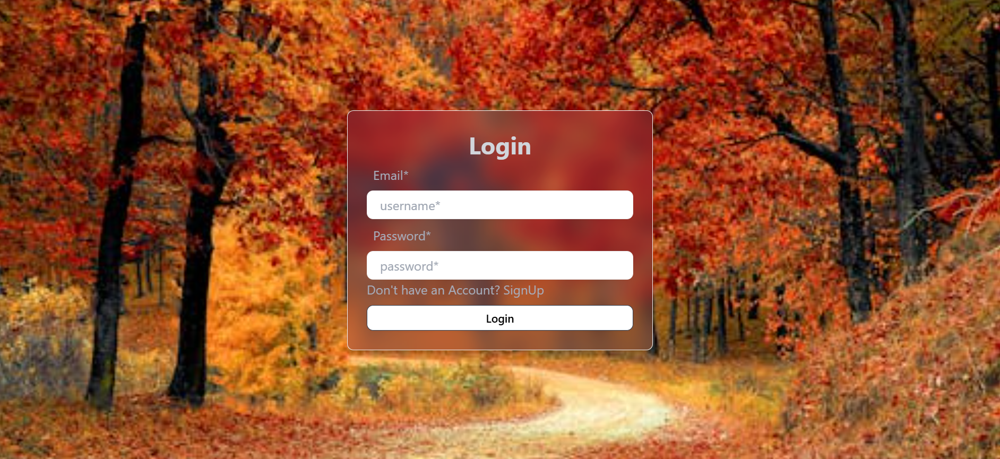

# 📚 MERN Chat Application

A full-stack real-time chat application built with **MongoDB**, **Express**, **React**, and **Node.js**, featuring:

- User Authentication (Register/Login)
- User Authorization (Protected routes)
- Real-time Chatting using **Socket.IO**
- Online Users Status Indicator
- Clean and Minimal UI
- **Text-only chat** (No file or video sharing)

---

## 🚀 Features

- 🔒 **Authentication**: Secure signup/login with JWT (JSON Web Tokens).
- 🛡️ **Authorization**: Only authenticated users can access the chat area.
- 💬 **Real-time Messaging**: Instant messaging powered by **Socket.IO**.
- 🔴 **Online Status**: See which users are online.
- ❌ **No File or Video Sending**: Only text messages are allowed for clean communication.

---

## 🛠️ Tech Stack

| Frontend | Backend | Real-Time | Database |
|:---|:---|:---|:---|
| React.js | Node.js | Socket.IO | MongoDB |
| TailwindCSS / CSS | Express.js |  | Mongoose |

---

## Screenshots

### Login Page


### SignUp_page


### Chat Room


---

## 🏧 Project Structure

```
/client    (React frontend)
/server    (Node/Express backend)
```

---

## ⚙️ Installation and Running Locally

### 1. Clone the Repository

```bash
git clone https://github.com/your-username/your-chat-app.git
cd your-chat-app
```

### 2. Set Up the Backend

```bash
cd server
npm install
```

- Create a `.env` file inside `/server`:

```env
PORT=5000
MONGO_URI=your_mongodb_connection_string
JWT_SECRET=your_jwt_secret_key
```

- Start the backend server:

```bash
npm run dev
```

### 3. Set Up the Frontend

```bash
cd ../client
npm install
```

- Start the frontend server:

```bash
npm start
```

---

## 🔌 WebSocket Setup (Socket.IO)

- **Server side**:  
  Using `socket.io` to manage real-time messaging and user connection status.

- **Client side**:  
  Connecting sockets inside React app and updating online/offline user status dynamically.

---

## 📋 API Routes

| Method | Endpoint            | Description            |
|:------:|:--------------------|:-----------------------|
| POST   | /api/auth/register   | Register a new user     |
| POST   | /api/auth/login      | User login              |
| GET    | /api/messages/:id    | Fetch chat messages     |
| POST   | /api/messages/send   | Send a new message      |

---

## ✨ Future Enhancements (Optional)

- Typing indicator (e.g., "User is typing...")
- Group chats / channels
- Message deletion/editing
- Notifications system

---

## 👨‍💼 Author

- **Your Name** – [@yourgithub](https://github.com/yourgithub)

---

## 📃 License

This project is licensed under the MIT License - see the [LICENSE](LICENSE) file for details.

---

# 🌟 Quick Start Commands

```bash
# Backend
cd server
npm install
npm run dev

# Frontend
cd client
npm install
npm start
```


